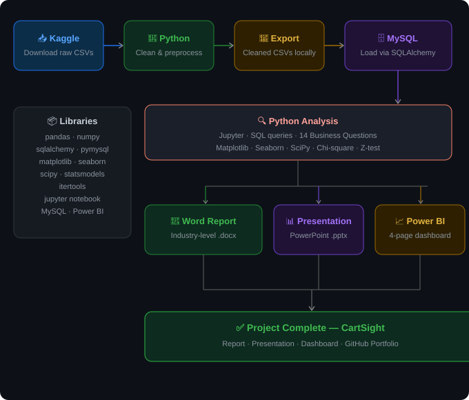

# TheLook-E-Commerce-Cart-Abandonment-Funnel-Analysis

---

## 📌 Project Overview

An end-to-end data analytics project built on the **TheLook E-Commerce** dataset — a fictitious clothing retail platform developed by Google Looker, publicly available on Kaggle and Google BigQuery.

**Core Business Question:**
> Where exactly are customers dropping off in the checkout funnel, which segments abandon the most, and what is the revenue impact of cart abandonment on a weekly and monthly basis?

**14 analytical questions** were explored covering funnel behavior, customer segmentation, traffic channel attribution, product & pricing analysis, revenue quantification, hypothesis testing, and behavioral pattern analysis.

---

## 🔄 Project Workflow

---

## 🗂️ Dataset

| Attribute | Detail |
|-----------|--------|
| Source | Google BigQuery Public Dataset / Kaggle |
| Platform | TheLook E-Commerce (Fictitious by Google Looker) |
| Total Tables | 7 |
| Raw Rows | ~3.2 Million |
| Post-Cleaning Rows | ~835,000 |
| Time Period | 2019 – 2024 |

| Table | Description | Rows (Clean) |
|-------|-------------|:------------:|
| `orders` | Order-level status and timestamps | 125,226 |
| `order_items` | Line-item detail — product, price, status | 181,759 |
| `users` | Customer demographics and traffic source | 99,042 |
| `products` | Product catalog — category, brand, pricing | 29,120 |
| `events` | Web session behavior — clicks, cart, purchase | 300,000 *(sampled)* |
| `inventory_items` | Inventory cost and stock records | 100,000 *(sampled)* |
| `distribution_centers` | Warehouse locations | 10 |

---

## 📊 Analysis Questions

### 🔻 Section 1 — Funnel & Conversion
- Q1. Overall conversion rate: session start → product view → cart → purchase. Biggest drop-off step?
- Q2. How does cart-to-purchase conversion vary by month? Is abandonment worsening over time?
- Q3. Avg events completed before abandoning vs. before purchasing?

### 👥 Section 2 — Customer Segmentation
- Q4. Do first-time visitors abandon at a higher rate than returning customers?
- Q5. Which age groups have the highest cart abandonment rates?
- Q6. Is abandonment rate significantly different between male and female customers? *(Chi-Square Test)*
- Q7. Which countries or cities have the highest concentration of abandoned sessions?

### 📡 Section 3 — Traffic Source & Channel
- Q8. Which traffic source brings users with the highest abandonment rate?
- Q9. Is the difference between traffic sources statistically significant? *(Proportion Z-Test)*

### 🛍️ Section 4 — Product & Category
- Q10. Which product categories have the highest cart-but-no-purchase rate?
- Q11. Are high-price products abandoned more? Is there a price threshold where abandonment spikes?
- Q12. Which specific products appear most frequently in abandoned sessions?

### 💰 Section 5 — Revenue Impact
- Q13. Estimated weekly and monthly revenue lost due to cart abandonment?

### 🧠 Section 6 — Behavioral Pattern
- Q14. Do cancelled/returned orders show different session behavior at browse/cart stage?

---

## 🔑 Key Findings

| Metric | Finding |
|--------|---------|
| Cart-to-Purchase Conversion Rate | **32.08%** |
| Biggest Funnel Drop-off | **Cart → Purchase (67.92%)** |
| First-Time Visitor Abandonment | **97.20%** |
| Returning Visitor Abandonment | **87.69%** |
| Total Revenue Lost (All Time) | **$756,855** |
| Monthly Revenue Lost (Jan 2024) | **$57,861** |
| Top Abandonment Country | **China — 12,112 sessions** |
| Top Abandonment Channel | **Adwords — 93.22%** |
| Gender Difference (Chi-Square) | **Not Significant (p = 0.55)** |
| Traffic Source Difference (Z-Test) | **Not Significant (all p > 0.05)** |
| Cancelled/Returned Users | **21% more active browsers** than completed order users |

---

## 🛠️ Tech Stack

| Tool / Library | Purpose |
|----------------|---------|
| `Python 3.14.5` | Core programming language |
| `pandas` | Data cleaning and manipulation |
| `numpy` | Numerical operations |
| `sqlalchemy` | Database ORM and connection engine |
| `pymysql` | MySQL database driver |
| `matplotlib` | Data visualization |
| `seaborn` | Statistical visualizations |
| `scipy` | Hypothesis testing — Chi-square, Z-test |
| `statsmodels` | Statistical modeling and testing |
| `itertools` | Pairwise combinations for Z-test |
| `MySQL 8.0` | Relational database storage |
| `Jupyter Notebook` | Analysis and exploration environment |
| `Power BI Desktop` | Interactive 4-page dashboard |

---

## 📸 Dashboard — 4 Pages

| Page | Content |
|------|---------|
| Executive Overview | Funnel KPIs, conversion trend, revenue lost |
| Customer Segmentation | Age, gender, visitor type, geographic map |
| Traffic & Channels | Channel abandonment, Z-test results matrix |
| Product & Revenue | Category analysis, price buckets, weekly trend |

---

## 📄 Dataset Source

[TheLook E-Commerce — Kaggle](https://www.kaggle.com/datasets/mustafakeser4/looker-ecommerce-bigquery-dataset)

---

## 👤 Author

**Elvis George**
)

---

*Built with Python · MySQL · Power BI · Jupyter*
